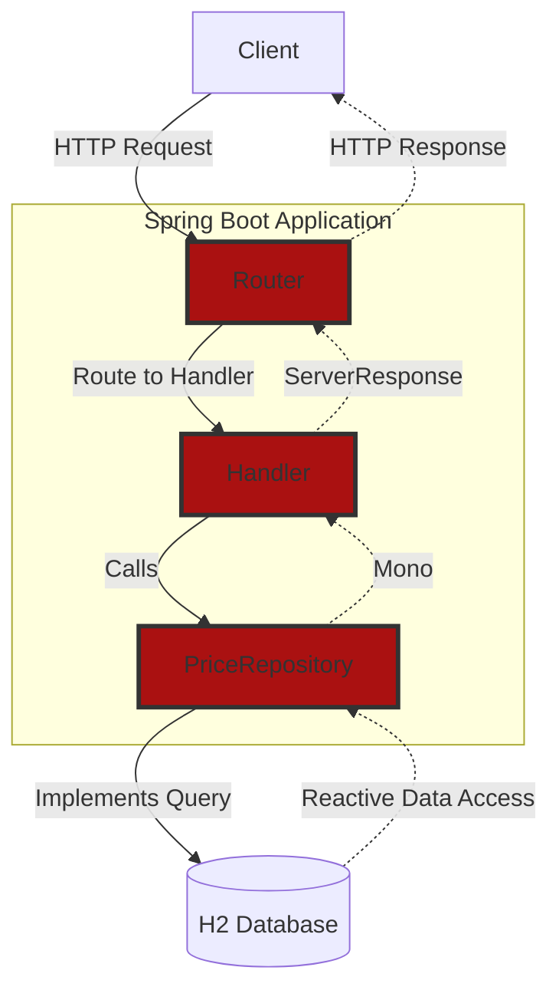

<h1 align="center">
   <div>Backend POC</div>
</h1>

## Table of Contents

- [Overview](#overview)
- [Requisites](#requisites)
- [Architecture](#architecture)
- [Continuous integration](#continuous-integration)
- [Run the app](#run-the-app)

## Overview

This repository contains a backend POC using Spring Boot, WebFlux and Data.

## Requisites

Backend is built with:

- Maven 3.9.6 (included in the wrapper)
- [Java JDK 21](https://adoptium.net/)
- [Spring Web Flux](https://docs.spring.io/spring-framework/reference/web-reactive.html)
- [Spring Data R2DBC](https://docs.spring.io/spring-data/relational/reference/r2dbc.html)

## Architecture

This project uses a simple implementation of the hexagonal architecture, applying the vertical slicing technic to
separate each functional use case.
We have a `price` slice that contains:

- The **domain** layer, that is generated from the [OpenAPI specification](./src/main/resources/openapi.yml).
- The **application** layer, that handles all the business logic of the application.
- The **infrastructure** layer, that connects to the exterior agents by receiving HTTP calls and routing them to the
  correct handler.

The architecture outlined encompasses a reactive web service designed with Spring Boot, specifically leveraging the
capabilities of Spring WebFlux for handling web requests and Spring Data R2DBC for database interactions. At its core,
the service is structured to efficiently manage data retrieval operations in a non-blocking, reactive manner, catering
to modern web application standards where scalability and performance are paramount. Here's a summary of its components
and workflow:

1. Client interaction:
   The starting point is the client, represented here by a user making HTTP requests. This could be a browser, a mobile
   app, or any client capable of sending HTTP requests to the server.

2. Router
   configuration ([`PriceRouter.java`](./src/main/java/com/fortun/backend/price/infrastructure/PriceRouter.java)):
   Upon receiving a request, the Spring Boot application uses RouterFunctions to direct the request to the appropriate
   priceHandler based on the URL and HTTP method. This approach decouples routing logic from request handling, enhancing
   modularity and clarity.

3. Request handling ([`PriceHandler.java`](./src/main/java/com/fortun/backend/price/application/PriceHandler.java)):
   The selected priceHandler is responsible for processing the incoming request. It parses query parameters, validates
   inputs, and performs business logic, which includes calling on the repository interface to fetch or manipulate data
   stored in the database.

4. Reactive
   repository ([`PriceRepository`](./src/main/java/com/fortun/backend/price/application/PriceRepository.java)):
   The repository interface defines reactive methods for database access, leveraging Spring Data's support for R2DBC.
   This allows for non-blocking I/O operations when querying the database, fitting seamlessly into the reactive
   programming model employed by the entire service architecture.

The actual data storage and retrieval are managed through R2DBC, which provides a reactive API for SQL operations,
enabling efficient interaction with relational databases without blocking threads. This is crucial for maintaining high
throughput and low latency in web services.

After retrieving the necessary data, the service constructs a reactive ServerResponse object, which is then sent back to
the client. This response can dynamically include data fetched from the database, encapsulated in a format suitable for
client consumption (JSON).

Throughout this process, the service utilizes reactive streams to handle data flow and backpressure. This means the
application can handle a large number of concurrent requests and data operations efficiently, adjusting dynamically to
the available resources and demand.



## Continuous integration

The CI pipeline is triggered by pull request activities (opened, synchronize, reopened) on the GitHub repository,
excluding markdown files (**/*.md) to avoid unnecessary runs for documentation updates.

Steps in the CI Pipeline:

1. Checkout repository: Utilizes the `actions/checkout@v4` action to fetch the codebase, allowing subsequent steps to
   operate on it.

2. Setup JDK: Uses `actions/setup-java@v4` to prepare the Java environment, specifically targeting Temurin distribution
   Java 21. This ensures that the Java version used in CI matches the project's requirements.

3. Build, test, and install artifact: Executes the Maven command `./mvnw -B clean install` to build the application, run
   unit tests, and install the artifact into the local Maven repository. The -B flag ensures Maven runs in
   non-interactive (batch) mode, suitable for CI environments.

4. Mutation test: Carries out mutation testing with [PITest](https://pitest.org/), enhancing the test suite's
   effectiveness and identifying
   missing checks or assertions in tests. It's invoked via `./mvnw -B test-compile org.pitest:pitest-maven:
   mutationCoverage`.

This pipeline ensures that all changes are built and tested, maintaining code quality and functionality with automated
checks.

Dependabot:

- Dependabot is configured in the [dependabot.yml](./.github/dependabot.yml) file to update both the Maven dependencies
  and GitHub Actions used in the workflow automatically. It checks for updates daily and opens pull requests with
  version bumps, ensuring the project dependencies and actions remain current without manual intervention.

## Run the app

To run the application you can first compile it and run the tests using:

```shell
./mvnw clean install
```

And then run the Spring Boot application with:

```shell
./mvnw spring-boot:run
```

To make a quick test:

```shell
curl -X GET -H "Content-type: application/json" "http://localhost:8080/price?requestDateTime=2020-06-14T10:00:00&productId=35455&brandId=1"
```

To see the code coverage report provided by [JaCoCo](https://www.jacoco.org/) (report is
in `target/site/jacoco/index.html`):

```shell
./mvnw clean install jacoco:report
```
